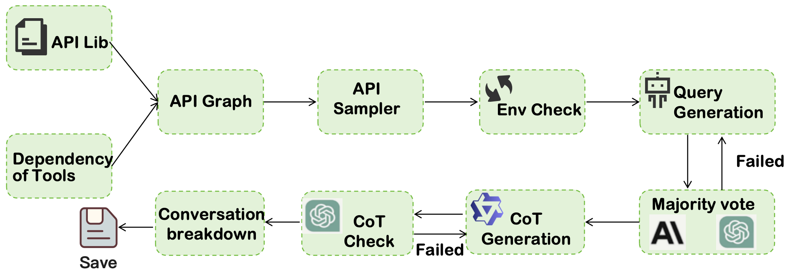

# Open-Agentic-tool-use

Real-world tool-using is the last step.

## Overview

Here, we present a open reproduction the **Large-Scale Agentic Data Synthesis for Tool Use Learning** of Kimi K2, which is a part of the open-sourced progarm of [AWorld](https://github.com/inclusionAI/AWorld?tab=readme-ov-file), inclusion AI. Data is available at [here](https://www.modelscope.cn/datasets/hbg400/Open-Agentic-tool-use).

Our Goal is to build a general data synthesis pipeline for multi-turn tool-use in various environments

We will open souce the whole pipeline after the code review of Ant Group soon.

## News

* ⚡️ [2025/07/25]  We first open source part of our data, which is built based on environments in BFCLv3 and contains more than 70k data.
  The data is available at [ModelScope](https://www.modelscope.cn/datasets/hbg400/Open-Agentic-tool-use).

## Introduction



Here we first build API relationship graphs for the eight environments from BFCLv3, select several relationship graphs for API sampling and random parameter construction, and then further check whether these APIs can be are executed in the environment. Then, the user agent generates questions based on the sampled API and environment feedback, use GPT-4o and Claude-4 for majority voting verification, and then use QwQ-32B to complete the thought chain and check it. Finally, we split each round of data in multiple rounds into a single round and perform SFT.

The data here is in a 100% executable standard format and can also be used for reinforcement learning training.

**Performance: Qwen2.5-7B-Instruct from near 0% acc on BFCLv3 multi-turn to 30% acc with simple SFT!**

## Acknowledgements

We are especially grateful to the BFCL and other teams for building high-performance tool-use models.

## Citation

If you find this project is useful in your own work, please consider citing as follows:

```
@misc{openr1,
    title = {Open-Agentic-tool-use},
    url = {https://github.com/BingguangHao/Open-Agentic-tool-use},
    author = {{Aworld team, inclusionAI}},
    year = {2025}
}
```
